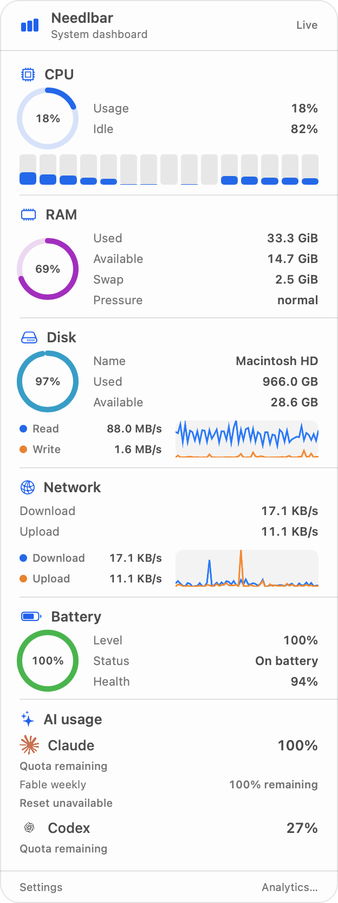
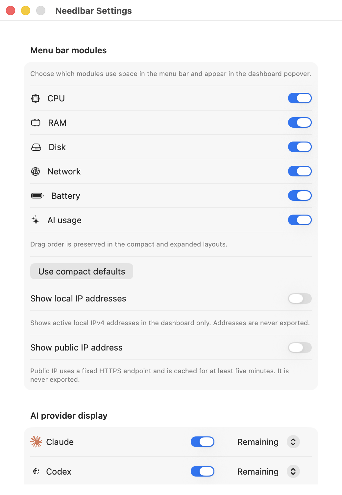
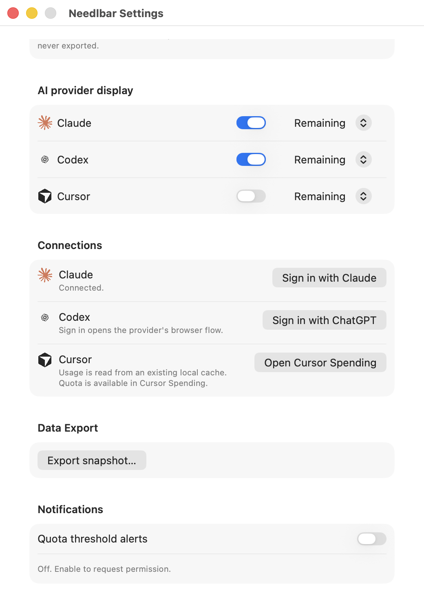

# Needlbar

Needlbar is a native macOS menu-bar monitor for Claude Code, Codex, and Cursor. It shows locally aggregated token usage, estimated cost, quota windows, and reset times.

Needlbar is local-first: it has no Needlbar account, backend, hosted sync, cloud analytics service, or telemetry.

## Availability and download

Needlbar v0.2.2 is publicly available for macOS 14 or later on Apple Silicon.

[Download Needlbar v0.2.2 for Apple Silicon](https://github.com/taejunoh/needlbar/releases/download/v0.2.2/Needlbar-macos-arm64.zip)

[Download the SHA-256 checksum](https://github.com/taejunoh/needlbar/releases/download/v0.2.2/Needlbar-macos-arm64.zip.sha256)

The `Needlbar-macos-arm64.zip.sha256` file is the SHA-256 checksum sidecar for the ZIP. Verify both downloaded files from the same directory:

```bash
shasum -a 256 -c Needlbar-macos-arm64.zip.sha256
```

The public artifact is Developer ID-signed and notarized.

To install the public release:

1. Download the ZIP and checksum sidecar from the v0.2.2 GitHub Release.
2. Run the checksum command from the directory containing both files.
3. Open the verified ZIP and drag `Needlbar.app` into `/Applications`.
4. Launch Needlbar from `/Applications`; it appears in the macOS menu bar.

`make package` creates only a local Apple-Silicon evaluation bundle. The local package is ad-hoc signed and is not a substitute for the public artifact.

Protected tagless validation is historical/pre-release evidence only and is not a public download.

Native signed macOS 14 arm64 Widget Gallery/App Group and notification-permission acceptance still require external evidence; the local macOS 26 build is not that acceptance.

## Current features

### Usage and quota monitoring

Needlbar presents locally aggregated token usage and estimated cost together with provider quota windows and reset times. Overview combines today’s tokens and estimated cost, the most constrained eligible quota, a seven-day usage chart, provider status, and Settings. Provider views show today’s usage/cost, input/output/cache token detail, quota/reset information, freshness, and safe recovery states. Usage and quota are independent refresh streams; a failure in one does not replace a previously valid value with zero.

Settings controls visible modules and title metrics. Claude and Codex expose provider-owned browser sign-in actions (`claude auth login --claudeai` and `codex login`); Needlbar does not implement a second OAuth flow. Cursor has no Needlbar credential or connection workflow.

### System monitor (v0.3 development build)

The main dashboard combines CPU, RAM, disk, network, battery, and AI usage in one compact popover. It uses aligned high-contrast values, hides normal freshness noise, and keeps stale or failed states visible without changing the underlying metrics or provider actions.



*Development build, not the public v0.2.2 artifact: values are native macOS examples, and provider visibility is configurable.*

AI summaries default to remaining subscription quota (the most constrained
available window), not token totals. Saved metric selections are preserved;
tokens and estimated cost remain selectable in Settings. An unavailable quota
is not replaced by a token count, and Cursor retains its Spending dashboard link.

Claude quota details can show Fable weekly remaining and reset when the provider
supplies a supported Fable limit; Fable shares the plan's weekly pool and is not
additional independent capacity. The separate Fable detail appears beneath
Claude when its selected metric is Remaining. It does not change the menu-bar
headline, snapshot export, widget, or quota notifications. Missing Fable data is
shown as unavailable rather than estimated from tokens or the overall weekly quota.

The live dashboard shows all six sections, usage gauges, per-core CPU bars,
and recent disk/network trends. Its fixed header and footer surround scrollable
content sized for the current screen. Trends retain at most 60 samples in
memory; no system-history database is created. Missing or stale readings are
identified explicitly. These changes are not in the public v0.2.2 ZIP above.

RAM excludes file-backed and purgeable cache from consumed physical memory;
Available is the complement and includes reclaimable memory. Memory uses
GiB/MiB, while storage capacity and transfer rates use decimal GB/MB and KB/s.
Swap comes from macOS, disk throughput uses native counter differences, and
battery health is full-charge capacity divided by design capacity when those
readings exist.

System metrics refresh locally once per second, including while the dashboard
is open. Transfer speed is shown by default in the dashboard. Local and public
IP display have separate settings, both off by default. Local IP shows a primary
address with additional addresses in a disclosure; public-IP lookup, when enabled,
uses only the fixed `https://api64.ipify.org?format=json` endpoint with a
two-second timeout and at least a five-minute in-memory cache. IP values never
enter exports, widgets, notifications, analytics, diagnostics, or provider
requests.

Settings also lets each Claude, Codex, and Cursor row be shown or hidden,
reordered, and set to display usage, remaining quota, cost, or connection
status. Existing provider refresh and browser-login ownership is unchanged.

### Settings (v0.3 development build)





*Same development Settings window at upper and lower scroll positions; current settings were inspected without changes. Provider rows show Remaining, and local/public IP remain off.*

### Local snapshot export

Settings includes **Export snapshot…**, a user-initiated JSON export of the current normalized provider snapshot. It does not refresh, authenticate, access Keychain, or upload data. The export contains only the approved normalized usage, quota, freshness, and safe status fields; it excludes credentials, account identifiers, raw paths/responses, prompts, assistant responses, source code, and raw diagnostics.

### Widget and quota notifications

The released app includes one medium Overview widget backed by a sanitized local projection. The widget does not refresh providers. Quota notifications are off by default, require explicit macOS permission, run only while Needlbar is running, and contain no credentials or raw provider data. They evaluate fresh Claude/Codex quota observations only, use conservative at-most-once local submission state, and do not apply to Cursor quota.

## Native macOS 14 acceptance (maintainer-only)

The public v0.2.2 ZIP is the production Gallery and entitlement evidence. The
separately signed fixture-driven artifact is acceptance-only and is not a
release or notarization substitute. It uses no provider account, credential,
network, Rust/C ABI, Keychain, or export data: sanitized fixtures are supplied
externally to the acceptance host. The trusted host signs the artifact before a
read-only guest transfer; credentials and keychains are never created on the
guest.

The bounded harness is run only on a disposable macOS 14 arm64 guest, with
public and acceptance artifacts kept separate:

```bash
make native-acceptance-harness-test
./scripts/native-acceptance-run.sh \
  --public-zip /Users/taejunoh/Developer/LFG/public-artifacts/Needlbar-macos-arm64.zip \
  --acceptance-app /Users/taejunoh/Developer/LFG/native-acceptance-app/Needlbar.app \
  --fixtures-root /Users/taejunoh/Developer/LFG/native-acceptance-input \
  --evidence-root /Users/taejunoh/Developer/LFG/native-acceptance-evidence \
  --case widget-baseline-update
```

Native acceptance remains an external maintainer gate and is not claimed by
the automated local or CI test matrix.

## v0.2.2 local repository analytics

The feature is released and remains local-only; no analytics history is retained after the in-memory state is discarded.

**Overview → Analytics…** opens a manual, on-demand view over the fixed closed 30-day interval ending at capture time. It uses only automatically observed local Claude, Codex, and Cursor workspaces and reports repository totals, provider/model breakdowns, local commit rows, optional local PR-number metadata, estimated cost, coverage, and **observed active AI-session time**.

Observed active AI-session time is derived from local session timestamps. It is not human coding time, keyboard time, elapsed wall time, or a productivity measure. Commit association is deterministic local time-window metadata, not causal attribution or measured commit cost. Estimated cost is not an invoice or subscription charge. Missing evidence remains visible as partial coverage or Unattributed data rather than becoming zero.

Analytics is manual and local-only: there is no startup scan, timer, watcher, background refresh, remote Git/forge request, provider authentication, network request, backend, database, or analytics history. Analytics does not change the v0.2.0 export schema or v0.2.1 widget/notification behavior.

## Provider support

The fixed provider set is Claude Code, Codex, and Cursor.

| Provider | Local usage source | Quota and recovery boundary |
| --- | --- | --- |
| Claude Code | `~/.claude/projects` and `~/.claude/transcripts` | Quota is available after provider-native sign-in and the approved explicit Keychain verification path. |
| Codex | `~/.codex/sessions` and available archived sessions | Quota uses existing provider authentication and its read-only fallback. |
| Cursor | Existing compatible local cache at `~/.config/tokscale/cursor-cache/usage.csv`; Needlbar does not create or refresh this cache. | Cursor quota is unavailable in Needlbar. **Open Cursor Spending** opens the provider-owned dashboard at `https://cursor.com/dashboard/spending`. |

Provider-local details are documented in the [Claude runbook](docs/providers/claude.md), [Codex runbook](docs/providers/codex.md), and [Cursor runbook](docs/providers/cursor.md).

## Privacy and local-first boundaries

Needlbar has no Needlbar account, backend, hosted sync, cloud analytics service, or telemetry. It reads only the documented local usage sources, and Claude/Codex quota requests go directly to their providers when applicable. Needlbar displays normalized counts, estimated costs, quota percentages, reset timestamps, freshness, and safe error states—not conversation or source content.

Needlbar does not use Cursor credentials, cookies, private endpoints, or remote usage hydration.

Needlbar never uploads token history, prompts, assistant responses, source code, raw paths, account identifiers, or provider credentials. Raw provider responses and credentials stay out of Swift state, diagnostics, logs, and bridge errors. Analytics has no database.

See [the privacy policy](docs/privacy.md) for the complete data-handling policy.

## Development

Swift 6-compatible Xcode and a Rust toolchain with Cargo are required. From a checkout:

```bash
git submodule update --init --recursive
source "$HOME/.cargo/env"  # when Rust was installed with rustup
make test
make run
make package
make smoke
```

`make test` is the project-wide verification command. `make package` and `make smoke` cover a local arm64 ad-hoc evaluation bundle. Local development does not perform release signing, notarization, stapling, or GitHub publication.

## Known limitations and documentation

- The public artifact requires Apple Silicon (`arm64`) and macOS 14 or later; Intel packaging is not supported.
- Cursor quota is unavailable inside Needlbar; use **Open Cursor Spending**.
- Analytics is a manual, bounded local analysis with best-effort local Git/PR metadata and no retained history.
- Native signed macOS 14 arm64 Widget Gallery/App Group and notification-permission acceptance still require external evidence; the local macOS 26 build is not that acceptance.

Read the [architecture guide](docs/architecture.md) for layer ownership and data flow, the [privacy policy](docs/privacy.md) for local reads and redaction, and the [Claude](docs/providers/claude.md), [Codex](docs/providers/codex.md), and [Cursor](docs/providers/cursor.md) runbooks for provider-specific sources and recovery.

For project security boundaries, see [SECURITY.md](SECURITY.md). For contributor setup and implementation rules, see [CONTRIBUTING.md](CONTRIBUTING.md), [AGENTS.md](AGENTS.md), and the [current development status](docs/STATUS.md). The approved [base design specification](docs/superpowers/specs/2026-08-13-needlbar-v0.1-design.md) and [implementation plan](docs/superpowers/plans/2026-08-13-needlbar-v0.1.md) provide the product and architecture contract.

The v0.3 system-monitor design and implementation plan are [documented here](docs/superpowers/specs/2026-09-02-needlbar-v0.3-system-monitor-design.md) and [here](docs/superpowers/plans/2026-09-02-needlbar-v0.3-system-monitor.md). Native macOS 14 Widget Gallery/App Group and notification-permission acceptance remains an external maintainer gate and is not claimed by the local test matrix.

The screenshot-driven dashboard refinement is documented in its
[design amendment](docs/superpowers/specs/2026-09-02-dashboard-readability-design.md)
and [implementation plan](docs/superpowers/plans/2026-09-02-dashboard-readability.md).

## Credits and licenses

Needlbar embeds the pinned [Tokscale/tokscale-core](https://github.com/Nanako0129/tokscale-core) usage engine. `tokscale-core` is Copyright (c) 2025 Junho Yeo and is licensed under the MIT License; its complete notice is retained in [`vendor/tokscale-core/LICENSE`](vendor/tokscale-core/LICENSE) and packaged apps at [`Resources/ThirdPartyNotices.txt`](Resources/ThirdPartyNotices.txt), which is copied into `Needlbar.app/Contents/Resources/ThirdPartyNotices.txt`.

Needlbar-owned source is licensed under the MIT License; see [`LICENSE`](LICENSE).
